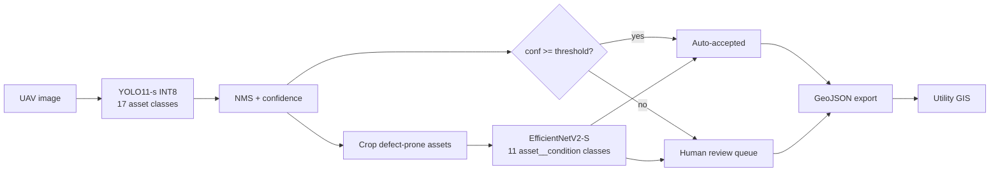

# Powerline Inspection Demo

[](https://github.com/Josh-E-S/powerline-inspection-demo/actions/workflows/ci.yml)
[](https://huggingface.co/spaces/ACloudCenter/powerline-inspection-demo)
[](https://huggingface.co/ACloudCenter/yolo11s-insplad-powerline)
[](LICENSE)
[](LICENSE)
[](requirements.txt)

**[Try the live demo](https://huggingface.co/spaces/ACloudCenter/powerline-inspection-demo)** ·
**[Download the models](https://huggingface.co/ACloudCenter/yolo11s-insplad-powerline)** ·
**[Technical report](docs/TECHNICAL-REPORT.md)** ·
**[Full results](docs/results/RESULTS.md)**

An end-to-end replica of an AI powerline inspection pipeline: UAV imagery
in, human-reviewed findings out as GIS-ready data. Two models detect power
line components and classify their condition, a confidence threshold splits
findings between auto-accepted and a human review queue, and everything
exports as GeoJSON for utility mapping software.

The point of the project is the deployment half, not the training half. On
the InsPLAD benchmark's own test split, a stock YOLO11-s quantized to
**10.6 MB** scores **0.726 Box AP**, exceeding the published baseline's
0.721 while being **1/93rd the size** and running on a CPU instead of a
discrete GPU.

## Results

Measured on the held-out test set (2,626 images, 6,324 instances), which is
the InsPLAD paper's own test split, verified by matching per-class counts
against its Table 3 for all 17 classes. Metric is COCO Box AP (IoU
0.50:0.95), the same definition the paper uses.

| Model | Params | Size | Box AP | AP50 | Throughput | Hardware |
|---|---|---|---|---|---|---|
| DetectoRS (published best AP) | 123.4M | 990.9 MB | 0.721 | 0.885 | 8.8 img/s | RTX 3080Ti |
| RetinaNet (published best AP50) | 56.3M | 756.2 MB | 0.706 | 0.891 | 11.7 img/s | RTX 3080Ti |
| **This work, 1280 INT8** | 9.4M | **10.6 MB** | **0.726** | **0.906** | 7.9 img/s | Apple M5 CPU |
| This work, 640 INT8 *(deployed)* | 9.4M | 10.1 MB | 0.710 | 0.889 | 33.2 img/s | Apple M5 CPU |

Condition classifier: **0.960 balanced accuracy** against the published
0.954, on the fault test split (6,417 crops).

Per-class results lead on 11 of 17 classes, with the four largest gains on
the four rarest small classes that were the floor of the published
benchmark. Regressions on the other six are reported in the
[technical report](docs/TECHNICAL-REPORT.md#53-per-class-comparison-against-the-published-benchmark).

## Architecture

InsPLAD's detection annotations carry no condition labels and its condition
crops carry no boxes, so the pipeline is necessarily two-stage.



Only five of the 17 asset classes carry condition labels, so stage two
runs on those crops alone:

| Asset | Conditions |
|---|---|
| glass insulator | good, missing-cap |
| lightning rod suspension | good, rust |
| polymer insulator upper shackle | good, rust |
| vari-grip | good, rust, bird-nest |
| yoke suspension | good, rust |

## What is in here

```
scripts/     prep, training, ONNX export + INT8 quantization, benchmarking
app/         Gradio demo served on Hugging Face Spaces (ONNX Runtime only)
notebooks/   Colab notebook for the training runs
docs/        technical report, results, diagrams, learning resources
```

## Reproducing

```bash
python -m venv .venv && .venv/bin/pip install -r requirements.txt
# download the dataset first: see data/README.md
python scripts/prep_insplad.py
python scripts/train_detector.py --imgsz 1280 --oversample --epochs 60 --patience 0
python scripts/train_classifier.py
python scripts/export_quantize.py --weights <best.pt> --classifier <best.pt> --imgsz 1280
python scripts/benchmark.py --imgsz 1280
```

Seed 42 throughout. The test split is read by exactly one script
(`benchmark.py`) and never during training or quantization calibration.
Training ran on Google Colab (L4 and A100); total compute cost was under
$10 of subscription usage.

## Honest scope

- Demo-scale replica, not a production system.
- Condition labels are image-level on cropped components. This detects
  components and classifies their condition; it does not localize defects
  at pixel level.
- Coordinates in the GeoJSON export are **simulated** along a real
  transmission corridor east of Tucson, AZ, and labelled as simulated in
  every exported feature. No GPS or EXIF data is used.
- Baselines are compared against numbers reported in the paper. The InsPLAD
  authors publish no checkpoints, so DetectoRS was not re-run here.
- Latency is measured on an Apple M5 CPU, not on the deployment target.
- The three glass-insulator shackle classes remain weak in absolute terms
  (0.34-0.47 Box AP) despite leading published results on them.

Two INT8 quantization failure modes were hit, diagnosed, and documented,
including one that passed a naive sanity check while producing a model that
detected nothing. Both are written up in the
[technical report](docs/TECHNICAL-REPORT.md#6-quantization-findings).

## Credits

Dataset: [InsPLAD](https://github.com/andreluizbvs/InsPLAD) by
Vieira-e-Silva et al., CC BY-NC 3.0
([paper](https://arxiv.org/abs/2311.01619)). This project consumes their
work; the dataset is the hard part and it is theirs. Models trained here are
derivative and likewise non-commercial.

Detector: [Ultralytics YOLO11](https://docs.ultralytics.com/models/yolo11/).
Classifier backbone: EfficientNetV2-S (torchvision).
