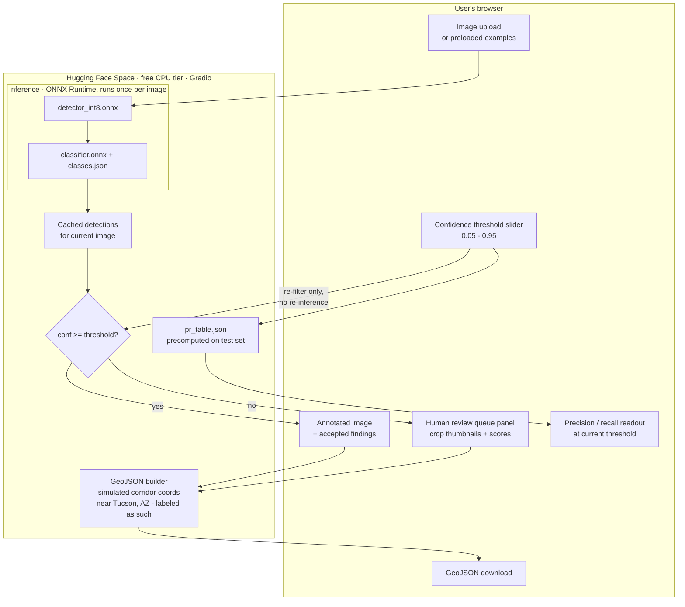

# App architecture: Gradio demo on Hugging Face Spaces (planned)

The human-in-the-loop story: one confidence threshold decides what the AI
auto-accepts vs what gets routed to a person. The slider makes that
business trade-off tangible.

Design decisions carried from the spec:

- Inference runs once per image; the slider re-filters cached detections
  client-side of the model, so dragging it is instant.
- The gate uses stage-1 detection confidence only. Classifier output is
  displayed but does not drive routing: one threshold, one clear story.
- The P/R readout is dataset-level (held-out test set), labeled as such in
  the UI, not a per-image number.
- No Ultralytics/torch at serve time; ONNX Runtime only, so the Space
  stays light and cold-starts reliably.
- GeoJSON: FeatureCollection of Point features with asset, condition,
  confidence, image id, timestamp; coordinates are simulated and marked
  simulated in both the file and the UI.
