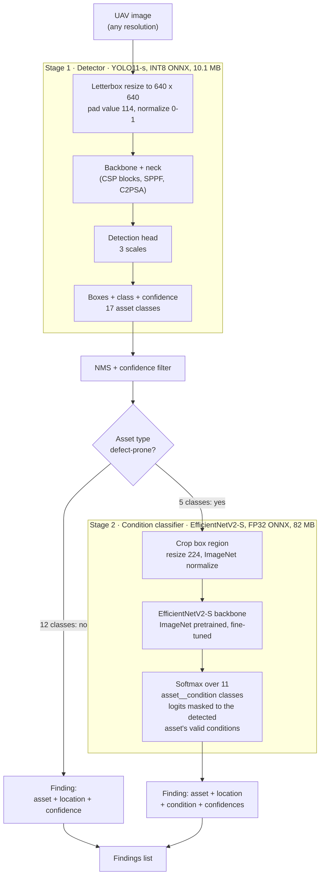

# Model architecture: two-stage inference pipeline

Why two stages: InsPLAD's detection annotations carry no condition labels
and its condition labels carry no boxes, so one model per question. Stage 1
answers "what and where," stage 2 answers "what condition."

Defect-prone asset types and their conditions:

| Asset | Conditions |
|---|---|
| glass insulator | good · missing-cap |
| lightning rod suspension | good · rust |
| polymer insulator upper shackle | good · rust |
| vari-grip | good · rust · bird-nest |
| yoke suspension | good · rust |

Quantization scope is detector-only: it is the model that sees the full
image every frame and dominates compute. The classifier only runs on small
crops and stays FP32.
