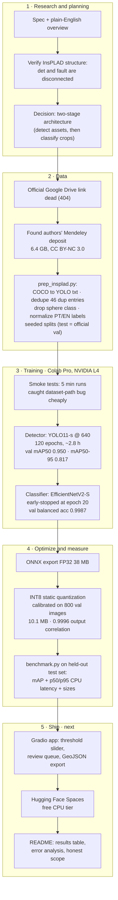

# Project pipeline: what we did, step by step

End-to-end record of how this project was built. Steps marked "next" are
not yet done.

```mermaid
flowchart TD
    subgraph research["1 · Research and planning"]
        A["Spec + plain-English overview"] --> B["Verify InsPLAD structure:<br/>det and fault are disconnected"]
        B --> C["Decision: two-stage architecture<br/>(detect assets, then classify crops)"]
    end

    subgraph data["2 · Data"]
        D["Official Google Drive link dead (404)"] --> E["Found authors' Mendeley deposit<br/>6.4 GB, CC BY-NC 3.0"]
        E --> F["prep_insplad.py:<br/>COCO to YOLO txt · dedupe 46 dup entries<br/>drop sphere class · normalize PT/EN labels<br/>seeded splits (test = official val)"]
    end

    subgraph training["3 · Training · Colab Pro, NVIDIA L4"]
        G["Smoke tests: 5 min runs<br/>caught dataset-path bug cheaply"] --> H["Detector: YOLO11-s @ 640<br/>120 epochs, ~2.8 h<br/>val mAP50 0.950 · mAP50-95 0.817"]
        H --> I["Classifier: EfficientNetV2-S<br/>early-stopped at epoch 20<br/>val balanced acc 0.9987"]
    end

    subgraph deploy["4 · Optimize and measure"]
        J["ONNX export FP32 38 MB"] --> K["INT8 static quantization<br/>calibrated on 800 val images<br/>10.1 MB · 0.9996 output correlation"]
        K --> L["benchmark.py on held-out test set:<br/>mAP + p50/p95 CPU latency + sizes"]
    end

    subgraph app["5 · Ship · next"]
        M["Gradio app: threshold slider,<br/>review queue, GeoJSON export"] --> N["Hugging Face Spaces<br/>free CPU tier"]
        N --> O["README: results table,<br/>error analysis, honest scope"]
    end

    C --> D
    F --> G
    I --> J
    L --> M
```
