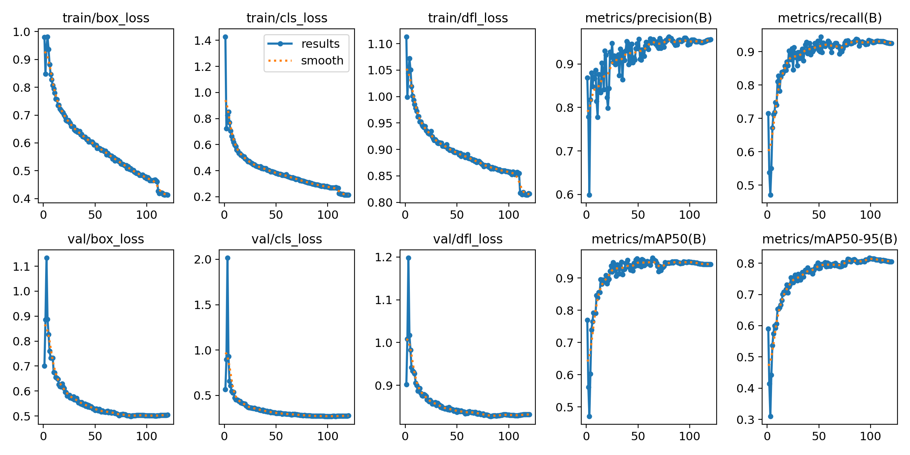
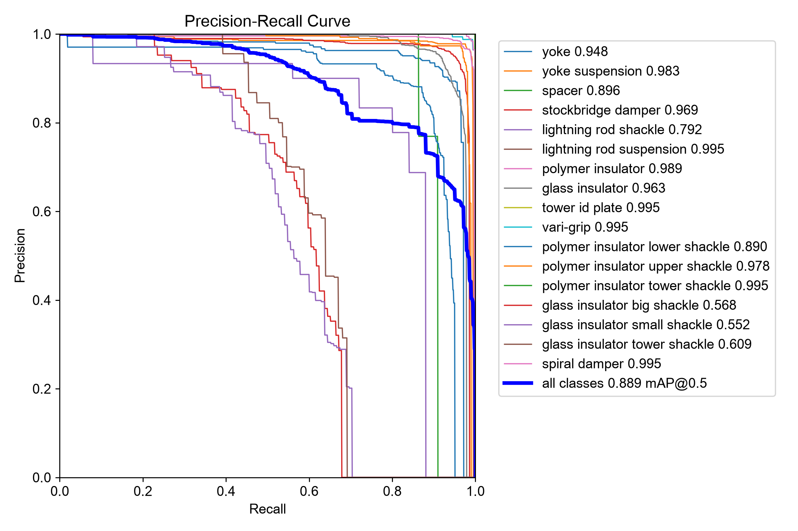
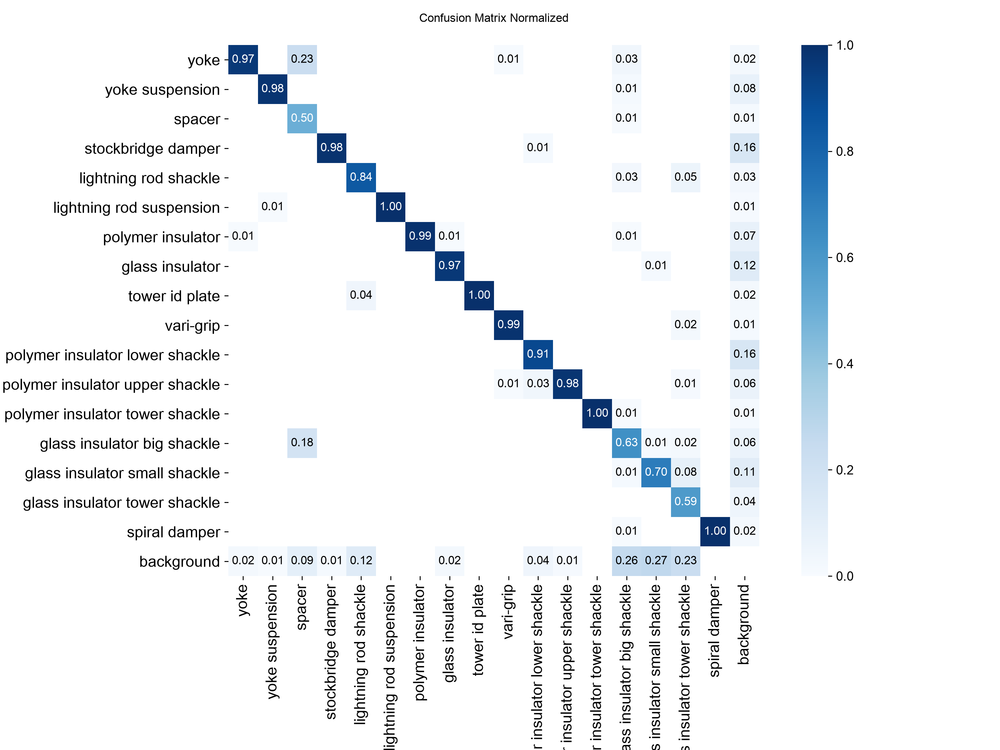
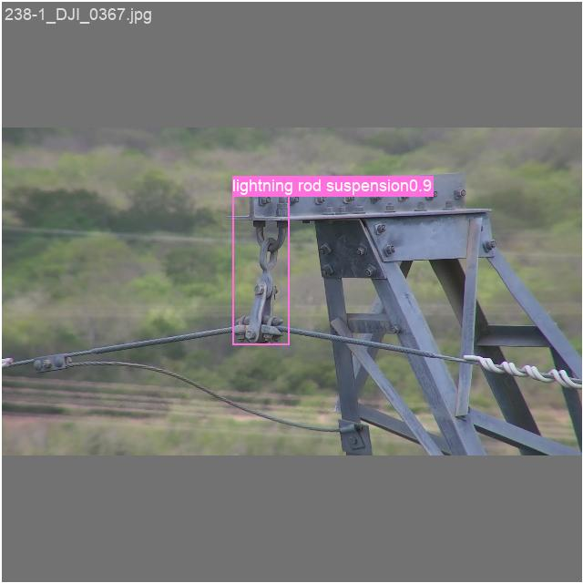

# Measured results

All numbers measured, none estimated. Detector metrics are on the held-out
test set, which is InsPLAD's official val split (2,626 images, 6,324
instances), so they are directly comparable to the published baselines.
The test set was touched exactly once, by scripts/benchmark.py.

## Training

- Detector: YOLO11-s, imgsz 640, 120 epochs (~2.8 h), Colab NVIDIA L4,
  seed 42. Best checkpoint by fitness around epoch 99.
- Classifier: EfficientNetV2-S, class-balanced sampling, early-stopped at
  epoch 20 (best epoch 10), ~11 min on the same L4.

The visible step at epoch 111 is `close_mosaic`: mosaic augmentation
switches off for the final 10 epochs and train losses drop sharply. Val
losses keep improving to the end; no overfitting signature.

## Detector: FP32 vs INT8 (the deployment trade)

Benchmarked on: Apple M5 (CPU), imgsz=640, 200 timed single-image runs
after warmup. INT8 is static quantization (QDQ, per-channel, Conv/MatMul
only) calibrated on 800 validation images.

| Model | Size (MB) | mAP50 | mAP50-95 | p50 latency (ms) | p95 latency (ms) |
|---|---|---|---|---|---|
| FP32 ONNX | 38.0 | 0.893 | 0.734 | 34.7 | 36.3 |
| INT8 ONNX | 10.1 | 0.889 | 0.710 | 30.1 | 32.1 |

Quantization cost: 0.4 points of mAP50 (2.4 of mAP50-95) for a 3.8x
smaller model that is ~13% faster on this CPU. Note Apple Silicon gains
less from INT8 than x86 with VNNI; the deployed Space (x86) should see a
larger speedup. Published context: the InsPLAD paper's best detector
(DetectoRS) reports 0.721 Box AP on this split.

## Second run: 1280 resolution + rare-class oversampling

Hypothesis: the weak classes are small and rare, so quadrupling pixels and
repeating rare-class images should lift them. Trained YOLO11-s at imgsz
1280 with `--oversample`, same seed and hyperparameters otherwise.
Early stopping fired at epoch 67 (best epoch 42), 2.6 h on an A100.

All four detector variants on the same held-out test set:

| Model | Size (MB) | mAP50 | mAP50-95 | p50 (ms) | p95 (ms) |
|---|---|---|---|---|---|
| 640 FP32 | 38.0 | 0.893 | **0.734** | 34.7 | 36.3 |
| 640 INT8 (deployed) | 10.1 | 0.889 | 0.710 | 30.1 | 32.1 |
| 1280 FP32 | 38.5 | **0.909** | 0.723 | 149.2 | 154.9 |
| 1280 INT8 | 10.6 | 0.883 | 0.683 | 122.4 | 127.3 |

A mixed result:

- **mAP50 improved to 0.909**, up from 0.893 at 640.
- **mAP50-95 did not improve** (0.723 vs the 640 run's 0.734). The best
  mAP50-95 in this project remains the 640 baseline.
- Every targeted weak class improved, but far less than the validation
  numbers implied. Test AP50, 640-INT8 to 1280-FP32: glass insulator
  small shackle 0.552 to 0.644, tower shackle 0.609 to 0.679, big shackle
  0.568 to 0.623, lightning rod shackle 0.792 to 0.830.
- The validation split showed these classes at 0.90-0.995, which looked
  like a blowout. It was small-sample optimism: val holds 5-20 instances
  of each shackle class against 97-149 in test. A useful reminder of why
  the held-out test set is the only number worth quoting.

Likely cause of the flat mAP50-95: early stopping ended the run at epoch
67, so the schedule never reached `close_mosaic` at epoch 111. Mosaic
augmentation stayed on for the entire run, and mosaic is known to trade
box precision for feature robustness. The 640 baseline did get its ten
mosaic-free epochs. This became the next experiment, below.

## Third run: 60-epoch schedule so close_mosaic actually fires

Same 1280 + oversampling recipe, but `--epochs 60 --patience 0`, so
`close_mosaic` triggers at epoch 50 and early stopping cannot skip it.
Confound to note: shortening the schedule also flipped Ultralytics'
`optimizer=auto` from MuSGD to AdamW, so two variables changed, not one.
A `--optimizer` flag now exists to pin this in future runs.

The mechanism is visible in the logs: at epoch 51 train box loss drops
0.474 to 0.460 and cls loss 0.286 to 0.246, exactly where mosaic closes.

Final results, all detector variants, same held-out test set:

| Model | Size (MB) | mAP50 | mAP50-95 | p50 (ms) | p95 (ms) |
|---|---|---|---|---|---|
| 640 FP32 | 38.0 | 0.893 | 0.734 | 34.7 | 36.3 |
| 640 INT8 (deployed) | 10.1 | 0.889 | 0.710 | 30.1 | 32.1 |
| 1280 120ep FP32 | 38.5 | 0.909 | 0.723 | 149.2 | 154.9 |
| 1280 120ep INT8 | 10.6 | 0.883 | 0.683 | 122.4 | 127.3 |
| **1280 cm60 FP32** | 38.5 | **0.912** | **0.738** | 150.3 | 155.6 |
| **1280 cm60 INT8** | 10.6 | 0.906 | 0.726 | 127.2 | 132.0 |

The hypothesis held. Closing mosaic lifted mAP50-95 from 0.723 to 0.738
(+0.015), enough to pass the 640 baseline's 0.734, so a single model now
leads on both metrics:

- **mAP50-95 0.738** against DetectoRS's 0.721.
- **mAP50 0.912** against DetectoRS's AP50 of 0.885.

Metric definitions are now verified, not assumed: the InsPLAD paper
defines its metric as "Box AP from MS COCO, also known as AP (with IoU as
0.50:0.95)" and reports DetectoRS at AP 0.721 / AP50 0.885 / AP75 0.749.
Same definition, same split, so the comparison is apples to apples.

On YOLOv8-ECCa, a 2026 paper that also targets InsPLAD-det: it reports
82.75% mAP50, which sits below the InsPLAD paper's own DetectoRS AP50 of
0.885. That gap implies a different split or evaluation protocol, so its
numbers are not treated as comparable here.

The quantized model is the more interesting claim. At 10.6 MB, cm60 INT8
scores 0.906 mAP50 and 0.726 mAP50-95, so **the quantized model alone
still exceeds the published DetectoRS number** while being small enough
to serve on a free CPU tier.

Quantization behaved much better here too: probability correlation 0.964
(against 0.837 for the 120-epoch run) and per-image detection counts
tracking FP32 closely (80 vs 80, 39 vs 39, 37 vs 37). The AdamW-trained
weights quantize cleanly where the MuSGD-trained weights did not, which
is a useful thing to know: quantization robustness is a property of the
trained weights, not only of the quantization settings.

Weak-class progress, AP50, 640-INT8 to cm60-INT8: lightning rod shackle
0.792 to 0.921, glass insulator tower shackle 0.609 to 0.645, big shackle
0.568 to 0.596, small shackle 0.552 to 0.581. The three glass-insulator
shackle variants remain the floor of the model and the honest limit of
what resolution and oversampling fixed; the remaining confusion is
between the variants themselves, which points at label ambiguity rather
than resolution.

Deployment decision: the Space still serves the 640 INT8 model. cm60 INT8
is meaningfully more accurate (+1.7 mAP50) but costs 127 ms per image
against 30 ms, and free-tier CPU cold starts favour the smaller input.
The 1280 model is reported as the best model trained.

Second quantization pitfall, caught by the hardened sanity check: INT8 at
1280 degrades much more than at 640 (2.6 points of mAP50 lost vs 0.4).
The check flagged it before the benchmark ran: box coordinate correlation
stayed at 0.9996 while class probability correlation fell to 0.837, and
per-image detection counts diverged on crowded scenes (76 detections in
FP32 against 12 in INT8) while simple scenes matched. Cause is almost
certainly MinMax calibration: 1280 inputs produce four times the anchor
positions and wider activation tails, so outliers stretch the scale until
small probabilities round to zero. Percentile calibration is the standard
fix; not applied here because the deployed model is the 640 one.

## Per-class error analysis (INT8, AP50)

Strong (0.89-0.995): everything with training support, including all
polymer insulator hardware, dampers, yokes, vari-grip, tower id plates.

Weak, and why:

| Class | AP50 | Train instances | Why it struggles |
|---|---|---|---|
| glass insulator small shackle | 0.55 | 108 | rare, small, and easily confused with the other two shackle variants |
| glass insulator big shackle | 0.57 | 101 | same confusion cluster |
| glass insulator tower shackle | 0.61 | 86 | same cluster, fewest examples |
| lightning rod shackle | 0.79 | 156 | rare and small |

Train instance counts are after the 10% validation carve-out. The three
glass-insulator shackle variants form one confusion cluster: each has
around a hundred training examples against 5,159 for the most common
class, and they look alike. They are not small in absolute terms: no
instance in the dataset falls below 32x32 px, and these classes have
median boxes of 206-498 px in 1920x1080 images. Scarcity and mutual
similarity, not size, are what they share. Higher training resolution
(1280) and rare-class oversampling are the planned levers; both are
wired into train_detector.py as flags.

Sample test-set predictions (INT8):

## Condition classifier

Balanced accuracy on the fault test split (official val, 6,417 crops):
**0.960** vs the paper's 0.954 EfficientNet baseline. Per-crop CPU
latency: 11.3 ms (p50).

Weakest class: glass-insulator missing-cap at 0.70 recall on a 30-crop
test set (9 misses). Every other class is at or above 0.95. The test
split is heavily skewed (yoke-suspension: 5,742 good vs 20 rust), which
is exactly why balanced accuracy is the reported metric.

## Quantization pitfall worth documenting

The first INT8 export scored zero mAP despite a 0.9996 whole-tensor
output correlation with FP32. Cause: YOLO's final output tensor mixes
pixel coordinates (0-640) and class probabilities (0-1); quantizing that
tensor forces one shared scale, rounding every probability to zero, and
the coordinate channels dominate any whole-tensor similarity statistic.
Fix: quantize Conv/MatMul ops only, and validate coordinates and
probabilities separately (see scripts/export_quantize.py). The lesson:
sanity checks must inspect the signal you actually care about.

## Raw data

- [benchmark_table.md](benchmark_table.md), [benchmark_results.json](benchmark_results.json)
- Full per-epoch training logs live in the Colab run dirs (results.csv,
  metrics.jsonl) on Drive; reproduce with notebooks/colab_training.ipynb.
